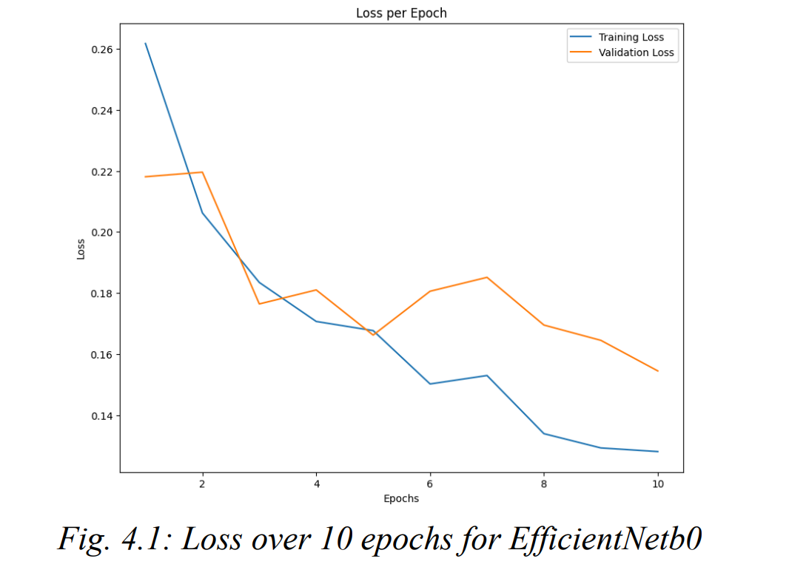

# 🧬 Melanoma Classification with CNNs // EfficientNetB0

An applied machine learning project focused on classifying skin cancer images into benign and malignant cases using deep convolutional neural networks. This project explores multiple CNN architectures, data augmentation strategies, optimisers, and hyperparameter tuning — with **EfficientNetB0** achieving state-of-the-art results.

> 🎓 Built as part of the EEEM068 – Applied Machine Learning coursework at the University of Surrey (2024).

---

## 🧠 Project Overview

- 🔍 Dataset: [Melanoma Skin Cancer Dataset (Kaggle)](https://www.kaggle.com/datasets/hasnainjaved/melanoma-skin-cancer-dataset-of-10000-images)
- 📸 10,605 high-resolution dermoscopic images
- 🧪 Classes: Binary – `0` (Benign) and `1` (Malignant)
- ⚖️ Balanced dataset with no missing values

---

## 🛠️ Models Evaluated

| Model         | Accuracy (%) | F1 Score  |
|---------------|--------------|-----------|
| ResNet34      | 92.46        | 0.9243    |
| ResNeXt101    | 92.55        | 0.9253    |
| MobileNetV2   | 90.94        | 0.9093    |
| **EfficientNetB0** | **96.80** | **0.9679** |

EfficientNetB0 was selected as the final model for its optimal performance vs resource efficiency.

---

## 📈 Final Results

🏆 Our best-performing model, **EfficientNetB0**, achieved the following:

| Metric         | Value     |
|----------------|-----------|
| Accuracy       | **96.80%** |
| F1 Score       | **0.9679** |
| Precision      | 0.9751    |
| Recall         | 0.9612    |
| AUC-ROC        | 0.979     |

✅ Model trained using `Adam` optimizer, `lr = 0.001`, `batch size = 64`, for 25 epochs  
✅ 3-fold validation was used to ensure generalizability  
✅ Dataset: [Melanoma Skin Cancer Dataset (Kaggle)](https://www.kaggle.com/datasets/hasnainjaved/melanoma-skin-cancer-dataset-of-10000-images)

---

## 🔍 Methodology

### 📂 Preprocessing & Augmentation
- Resized to 224x224
- Normalization (ImageNet mean/std)
- RandomHorizontalFlip, Rotation (±15°), ColorJitter, RandomResizedCrop

---

### ⚙️ Loss & Optimisation
- Loss: `BCELoss`
- Optimisers tested: `Adam` (best) and `SGD`
- Grid search for:
  - Learning rate (`[0.001, 0.01, 0.1]`)
  - Batch sizes (`[16, 32, 64]`)
- Best combo: `lr=0.001`, `batch_size=64`

---

### 📉 Performance Visualizations

| Training & Validation Loss | Confusion Matrix |
|----------------------------|------------------|
|  |  |

---

### 🧠 CNN Insights (Activation Maps)

These maps show the model learning important lesion features like border irregularity and asymmetry—core visual traits used by dermatologists.

---

## 📦 Tech Stack

- 📚 Python, PyTorch, NumPy, Matplotlib
- 🧠 CNN Architectures: ResNet, MobileNet, EfficientNet
- 📁 Jupyter Notebook for training and evaluation

---

## 📚 Future Work

- Incorporate multimodal data (e.g. clinical metadata)
- Explore unsupervised melanoma detection
- Integrate explainable AI features for clinical transparency

---

## 📄 Report

🔗 [Download Full Report (PDF)](./report.pdf)

---

## 👨‍🔬 Authors

- **Taman Bachani**  
- Azizbek Fatkhullaev  
- Aptha Sara Mohan  
- Yasar Efe Pekgoz

---

## 📫 Contact

For collaboration, reproduction, or research inquiry:

📧 workwith.taman@gmail.com  
🔗 [LinkedIn](https://www.linkedin.com/in/taman-bachani)

---

## 📝 License

MIT License
